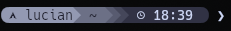
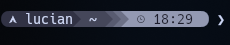
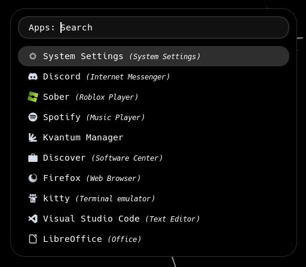

# KDE Plasma Dotfiles

A collection of configuration files (dotfiles) for a clean, high-contrast, and productive KDE Plasma desktop environment on Arch Linux.

The goal of this repository is to provide a consistent, minimalist aesthetic using the Catppuccin color scheme (Mocha).

---

## :rocket: Included Configurations

### Starship Prompt - Monochrome Versions

This collection includes two variants of the Starship prompt, both customized for a high-contrast, monochrome (grayscale) aesthetic using the **Catppuccin Mocha** palette.

**Available Versions (found in the `starship` directory):**

* **Light → Dark Gradient** (`starship/light_dark_preset.toml`)
* **Dark → Light Gradient** (`starship/dark_light_preset.toml`)

### Rofi (Application Launcher)

The Rofi configurations are set up to provide a fast, visually matching application launcher and custom menu replacement.

| Component | Description | File Location |
| :--- | :--- | :--- |
| `config.rasi` | The main Rofi configuration file. | `rofi/config.rasi` |
| `tokyo.rasi` | A custom color scheme or theme specific to your visual setup. | `rofi/tokyo.rasi` |

---

## :camera: Previews

### Preview: Starship Light → Dark

This is what the Starship terminal prompt looks like using the **Light → Dark** configuration:



### Preview: Starship Dark → Light

This is what the Starship terminal prompt looks like using the **Dark → Light** configuration:



### Preview: Rofi Application Launcher

This is what the **Rofi** launcher looks like with the custom `tokyo.rasi` theme:



---

## :package: Installation

To install these dotfiles, you can clone the repository and use a tool like **GNU Stow**, or manually symlink the files into your system's configuration directories.

### Manual Installation (Examples)

#### Starship

1.  **Choose your config** (e.g., `light_dark_preset.toml`).
2.  **Backup** your existing Starship configuration:
    ```bash
    mv ~/.config/starship.toml ~/.config/starship.toml.bak
    ```
3.  **Symlink** the new config:
    ```bash
    # Link the chosen file to the standard Starship path
    ln -s ~/path/to/this/repo/starship/light_dark_preset.toml ~/.config/starship.toml
    ```

#### Rofi

1.  **Backup** your Rofi config folder:
    ```bash
    mv ~/.config/rofi ~/.config/rofi.bak
    ```
2.  **Symlink** the new Rofi config:
    ```bash
    # Link the entire rofi folder
    ln -s ~/path/to/this/repo/rofi ~/.config/rofi
    ```

---

## :link: Attribution and Source

These monochrome presets are modifications of the official **Catppuccin Powerline preset** for Starship.

* **Original Preset Source:** [Starship Catppuccin Powerline](https://starship.rs/presets/catppuccin-powerline)
